# avax-academy

## 创建 Avalanche L1

```bash
# Install CLI
curl -sSfL https://raw.githubusercontent.com/ava-labs/avalanche-cli/main/scripts/install.sh | sh -s

# Add CLI to System PATH
echo 'export PATH=~/bin:$PATH' >> ~/.bashrc
source ~/.bashrc
```

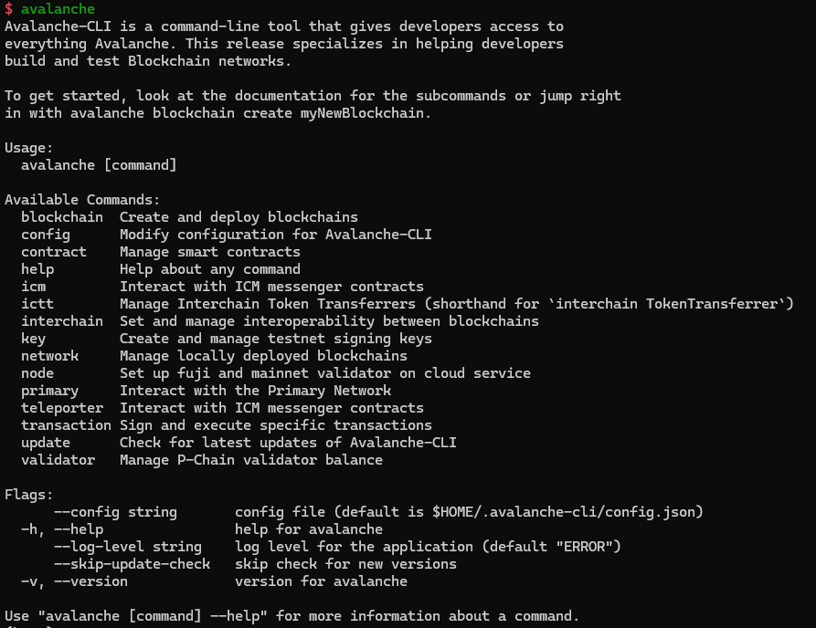

```bash
# Create L1 configuration
avalanche blockchain create myblockchain
```

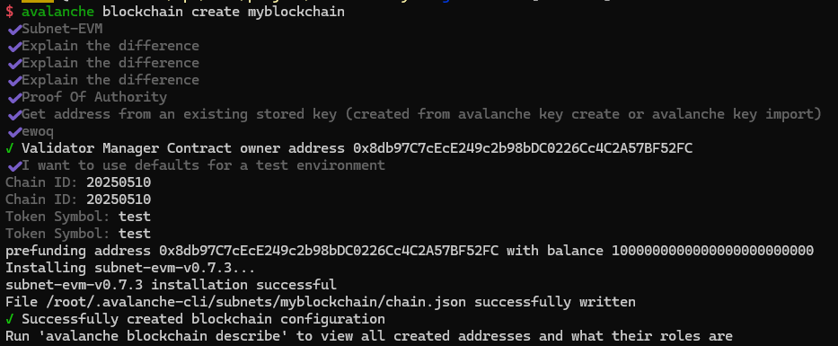

```bash
# Deploy L1 on Local
avalanche blockchain deploy myblockchain --local

```

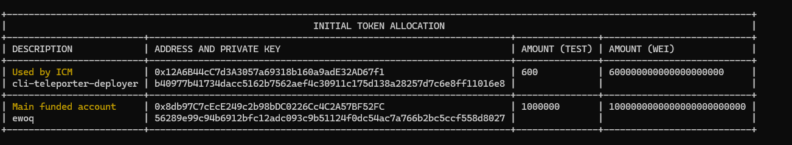

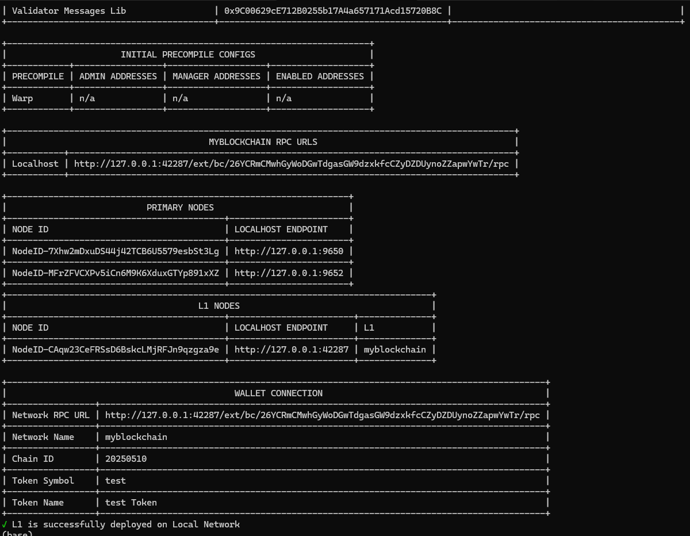


## 导入 MetaMask 

Network RPC URL、Chain ID、Main funded account 

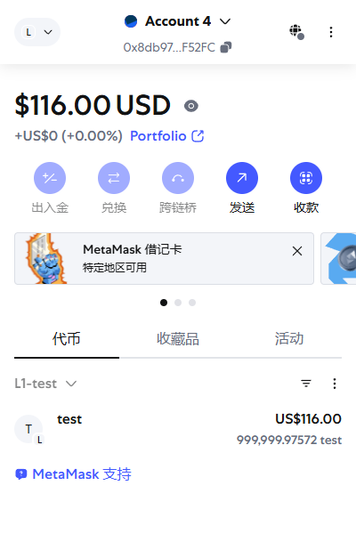

## 测试转账

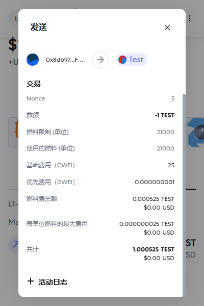

## 添加 Validator

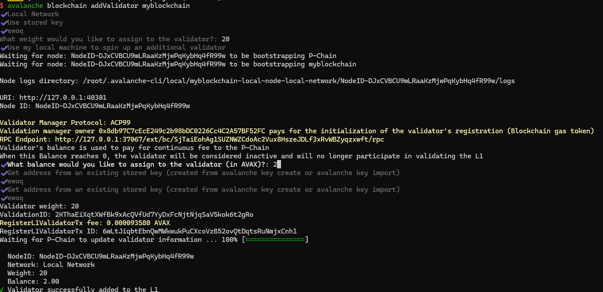

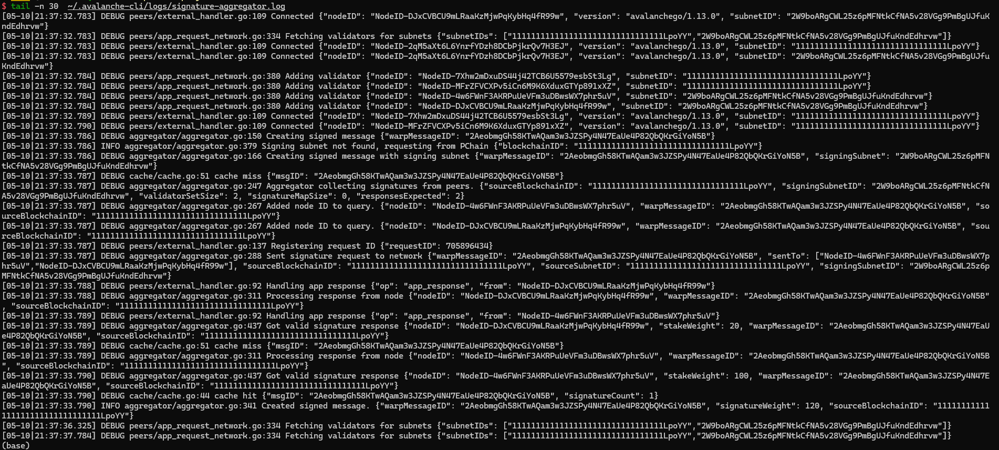

## 部署 ERC20, ERC721 工厂合约

```bash
export RPC_URL=http://127.0.0.1:37067/ext/bc/SjTaiEohAg1SUZNWZCdoAc2Vux8HszeJDLf3xRvWBZyqzxwft/rpc
export PRIVATE_KEY=56289e99c94b6912bfc12adc093c9b51124f0dc54ac7a766b2bc5ccf558d8027

npx hardhat ignition deploy ./ignition/modules/ERC20Factory.ts --network customize
npx hardhat ignition deploy ./ignition/modules/ERC721Factory.ts --network customize
```

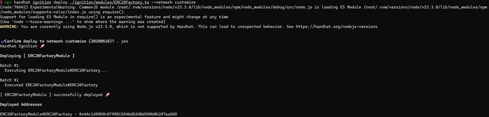

## 链上信息查询

```bash
# 查看账户余额
curl -X POST --data '{"jsonrpc":"2.0","method":"eth_getBalance","params":["0x8db97C7cEcE249c2b98bDC0226Cc4C2A57BF52FC", "latest"],"id":1}' -H "Content-Type: application/json" http://127.0.0.1:42203/ext/bc/2ip2zuU7TVnMRximYcXydPSxSvNtfkdn32AVRYZo5wnSD1D5gT/rpc

# 查询最近的区块信息
curl -X POST --data '{"jsonrpc":"2.0","method":"eth_getBlockByNumber","params":["latest", true],"id":1}' -H "Content-Type: application/json" http://127.0.0.1:42203/ext/bc/2ip2zuU7TVnMRximYcXydPSxSvNtfkdn32AVRYZo5wnSD1D5gT/rpc

# 查询交易信息
curl -X POST --data '{"jsonrpc":"2.0","method":"eth_getTransactionByHash","params":["0x2f045e265bc15005e3957f8ee2b33c4ef3b957e98123e623287c06bcf125d1da"],"id":1}' -H "Content-Type: application/json" http://127.0.0.1:42203/ext/bc/2ip2zuU7TVnMRximYcXydPSxSvNtfkdn32AVRYZo5wnSD1D5gT/rpc

# 查询一个合约地址
curl -X POST --data '{"jsonrpc":"2.0","method":"eth_getCode","params":["0xA4cD3b0Eb6E5Ab5d8CE4065BcCD70040ADAB1F00", "latest"],"id":1}' -H "Content-Type: application/json" http://127.0.0.1:42203/ext/bc/2ip2zuU7TVnMRximYcXydPSxSvNtfkdn32AVRYZo5wnSD1D5gT/rpc

```

查看账户余额

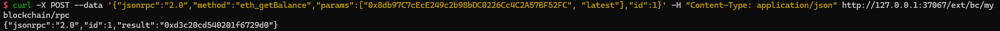

查询最近的区块信息

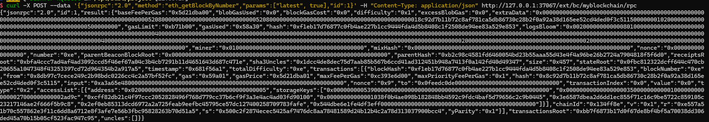

查询交易信息

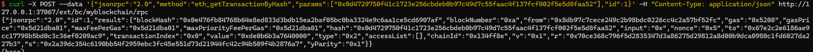

查看 ERC20 工厂合约链上地址

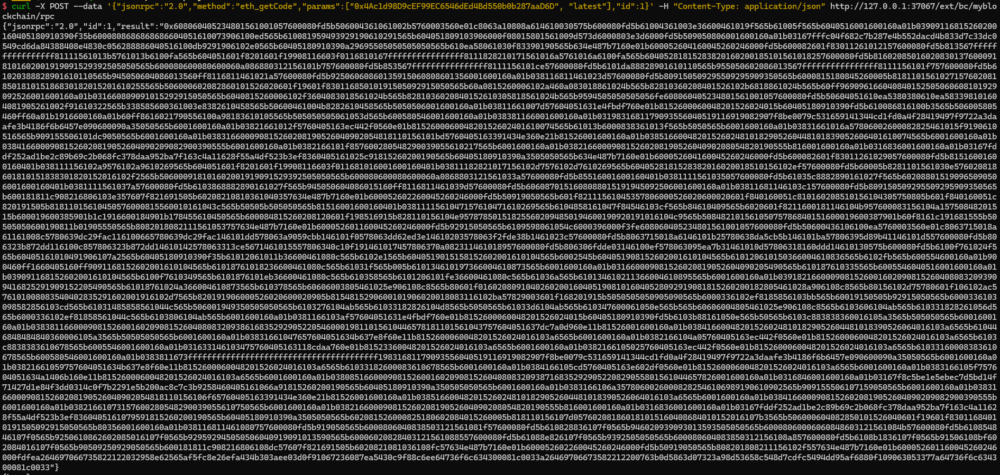

查看 ERC721 工厂合约链上地址

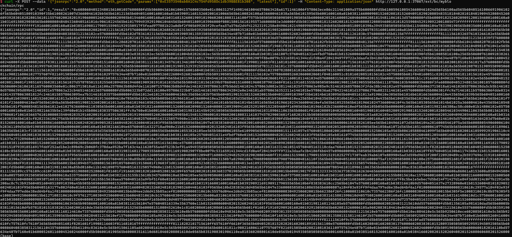

## 前端入口，支持自定义 L1 钱包连接

https://token-launcher-beryl.vercel.app/

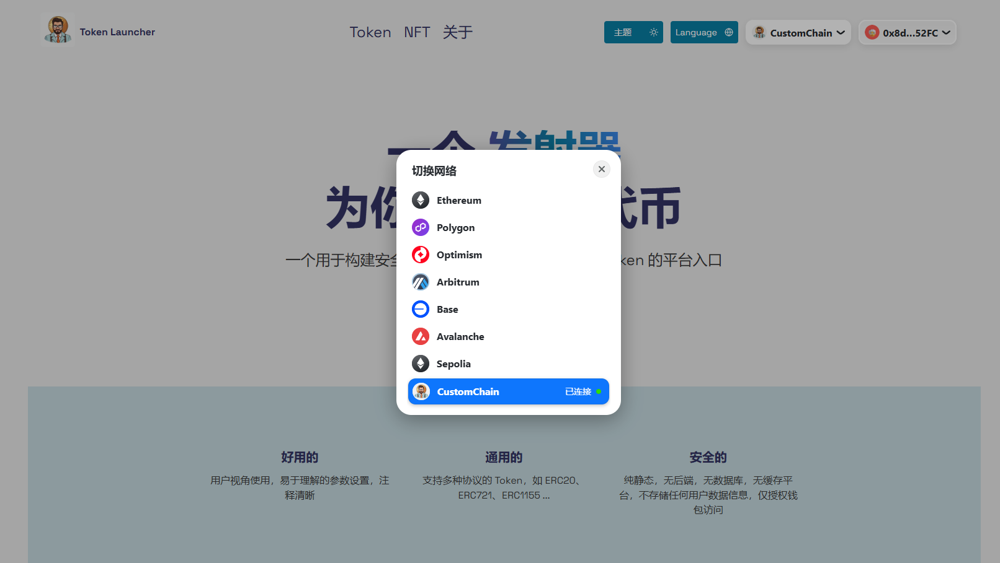

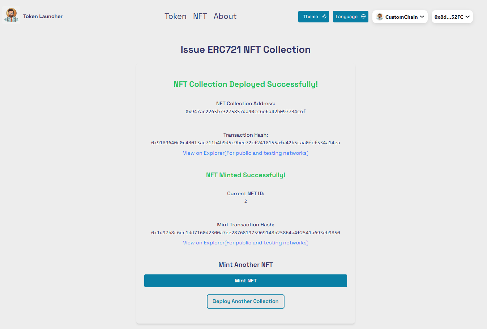

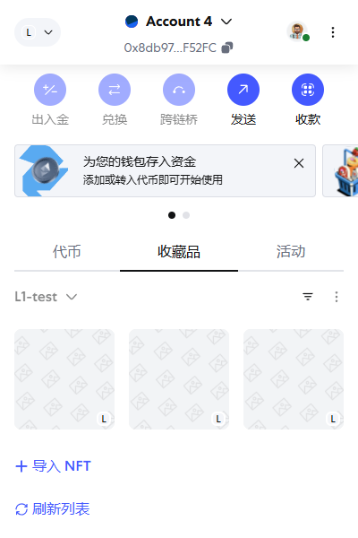
